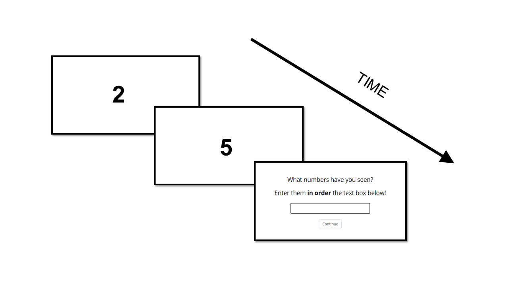

# Digit_Span_JSPsych

<i>Created by the MEMO Team of Lyon Neuroscience Research Center (CRNL) (PI: Dezso Nemeth)</i>
 

A classical Digit Span Task created with JSPsych <a href="https://link.springer.com/article/10.3758/s13428-014-0458-y">de Leeuw, J. R., 2015</a>.

<h2>Structure of the task</h2>

One digit (1-9) per second appears one the screen (only one at a time). The task of the user is to try to remember the digits in their order of appearance. After a few digits, a textbox appears on the screen and the user have to type in their answer. The answer can be submitted by clicking on the 'Continue' button, or by hitting Enter.

<figcaption><i>The Digit Span task. The user has to try to remember the presented digits in their order of appearance.</i></figcaption>
 

The task starts with two practice runs (with 2 digits per run). Here, the user receive feedback whether their answer was correct. After the two practice runs, the task begins. Altogether, seven levels can be completed. On the first level, three digits are presented, and on each level, the length of the digit stream become one digit longer (i.e., the maximum length is 9 digits). Each level contains four trials. If the user answers correctly in three out of the four trials, the next level is presented. If the level is not completed successfully (i.e., the user answers correctly for less than three trials), the task ends.

<h2>Output file</h2>

- <strong>success:</strong> whether fullscreen mode was successfully started/ended (true or false)
- <strong>trial_type:</strong> JSPSych trialtype of the given trial (fullscreen, html-keyboard-response or survey-html-form)
- <strong>trial_index:</strong> the number of the given trials (all events considered, even instructions, feedbacks!)
- <strong>time_elapsed:</strong> the time elapsed from the start of the script in ms
- <strong>subject:</strong> a 15-character long random subject ID for online version, and customized subject number for offline version
- <strong>session:</strong> customized session number (for offline version only)
- <strong>internal_code_id:</strong> internal node id of the trial
- <strong>browser_event:</strong> browser events at the given trial (fullscreenenter, fullscreenexit, blur or focus)
- <strong>view_history:</strong> viewing data about the instruction trial
- <strong>rt:</strong> the reaction time for submitting the answer
- <strong>test_part:</strong> the part of the task (instruction, start_practice, stimulus, answer, feedback, start_task, debrief)
- <strong>stimulus:</strong> stimulus on the screen in HTML
- <strong>key_press:</strong> number code of the key pressed
- <strong>level:</strong> the level of the task (2 for the practice runs, 3-9 for the task runs)
- <strong>correct_answer:</strong> the stimulus stream, the correct answer
- <strong>number_within_level:</strong> the number of the trial within the given level (1-2 for the practice runs, 1-4 for the task runs)
- <strong>number_within_run:</strong> the number of the stimulus within the run (1-2 for the practice runs, 1-9 for the task runs)
- <strong>is_mistake:</strong> if the answer given was uncorrect (0 - the answer was correct; 1 - the answer was incorrect)
- <strong>responses:</strong> the answer typed in the input field (in an object)
- <strong>digit_span:</strong> the digit span score (the length of the run where at least 3/4 trials were correctly remembered)

<h2>Setting options</h2>

You can set the following parameters by modifying the <i>parameters.js</i> file:

<ul>
    <li>duration of the stimulus (in ms): the digits' presentation time (default: 1000 ms)</li>
    <li>language: currently available languages are: english (en), hungarian (hu), spanish (es), french (fr), portuguese (pt)</li>
</ul>

<h2>How to start the task</h2>
Open the <i>index.html</i> file in either the <i>offline</i> or <i>online</i> folder. When the offline version is started, you can customize the subject and session numbers (any number is accepted). If you start the offline version, a random subject ID will be allocated.

<h2>Browser requirements</h2>

Any browser except Safari and Internet Explorer. Recommended: Chrome

